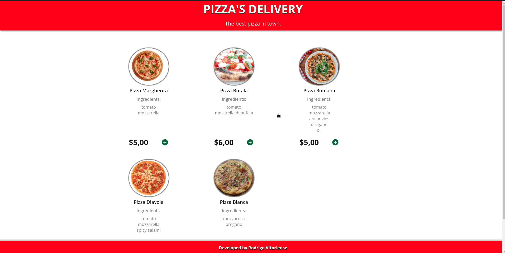

<h1 align="center">
    
</h1>

<h2 align="center"> 
	  Pizza Delivery
</h2>

<p align="center">
 <a href="#📷-demonstração">Demonstração</a> •
 <a href="#ℹ️-sobre">Sobre</a> • 
 <a href="#🛠-tecnologias">Tecnologias</a> • 
 <a href="#🔗-link-do-projeto">Link do projeto</a> • 
 <a href="#🚀-como-executar">Como executar</a> •
 <a href="#📚-construção-do-projeto-e-aprendizados">Construção do projeto e Aprendizados</a> • 
 <a href="#👨‍💻-autor">Autor</a> • 
 
</p>

<p align="center">
  <a href="https://www.linkedin.com/in/rodrigovitoriense/">

</a>

</p><br>

# 📷 Demonstração




<br>

# ℹ️ Sobre

<p>
Projeto desenvolvido para praticar o uso da biblioteca React.JS e com o objetivo de simular uma pequena aplicação web de pedidos de pizzas.

Neste projeto, os usuários devem ser capazes de:

- Ver o tamanho dos elementos ajustados com base no tamanho da tela de seus dispositivos;
- Adicionar ou remover o número de pizzas do pedido;
- Realizar as operações de adicionar ou remover um pedido;
- Efetuar o pedido.

Os dados das pizzas utilizados no projeto foram carregados a partir do arquivo public/server/pizzas.json.
</p>
  <br>

# 🛠 Tecnologias

As seguintes tecnologias foram utilizadas na construção do projeto:

- [ReactJS](https://reactjs.org/)
- [TypeScript](https://www.typescriptlang.org/)
- [Styled Components](https://styled-components.com/)
- [React Router Dom](https://v5.reactrouter.com/web/guides/quick-start)
- [Material-UI](https://mui.com/pt/)
  <br><br>

# 🔗 Link do projeto

- Link de demonstração do projeto: [Pizza' Delivery](https://pizza-delivery-silk.vercel.app/)
  <br>

# 🚀 Como executar

Clone o projeto e acesse a pasta.

```
$ git clone https://github.com/rodrigorvix/pizza-delivery.git
$ cd pizza-delivery
```

Siga os passos abaixo:

```
# Install the dependencies
$ yarn ou npm

# Start the project
$ yarn start
```

O aplicativo estará disponível para acesso pelo seu navegador em http://localhost:3000
 <br>

# 📚 Construção do projeto e aprendizados

<p>
Para realizar a construção do projeto foram seguidos alguns passos:

 -  Definição do layout: para a definição do layout realizei algumas pesquisas na [Dribbble](https://dribbble.com/) e em outros sites de pizzarias com o intuito de adquirir ideias para a construção de um layout simples e amigável. Após as pesquisas, desenhei um wireframe de baixa fidelidade para servir como guia de layout.

 - Definição das tecnologias: como ferramenta decidi escolher o React.JS que é a biblioteca que possuo mais experiência no momento e que atendia aos requisitos de desenvolvimento do projeto.

 - Construção dos componentes/layouts: tenho como método construir todos os componentes e seus estilos com dados estáticos.

 - Dados dinâmicos: após realizada a etapa de construção dos componentes realizo o desenvolvimento de requisões a APIs, uso de rotas, estados, contextos, entre outros. 
</p>

 <br>
 Seguem abaixo alguns conceitos das tecnologias que foram utilizadas no projeto:

 ## React:
    - Conceitos e uso de componentes, propriedades e estados;
    - Hooks;
    - Contextos.
    - Rotas

 ## TypeScript:
    - Tipagem de variáveis;
    - Melhoria na descoberta de falhas e bugs.
  
  <br>
  
# 👨‍💻 Autor

- [Linkedin](https://www.linkedin.com/in/rodrigovitoriense/)
- [GitHub](https://github.com/rodrigorvix)
  <br>

